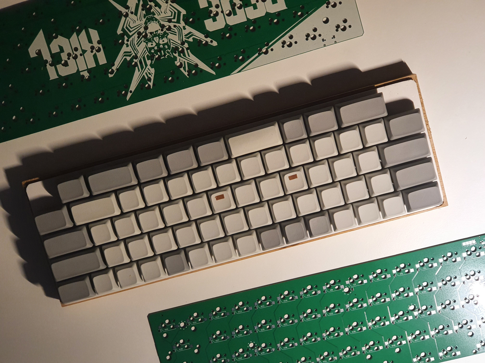
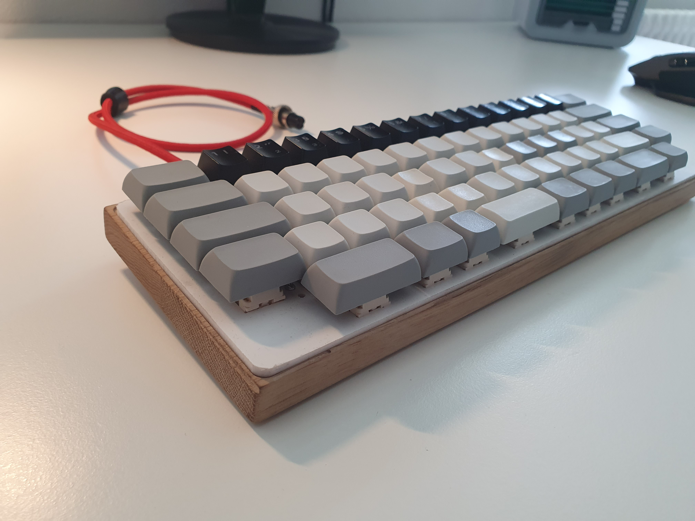
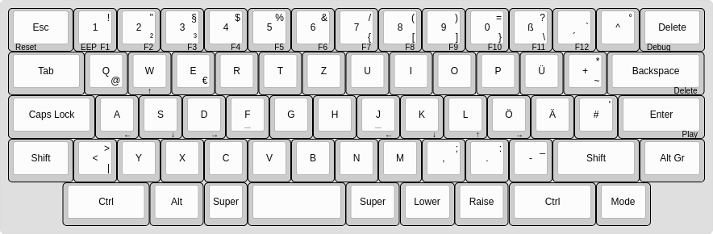
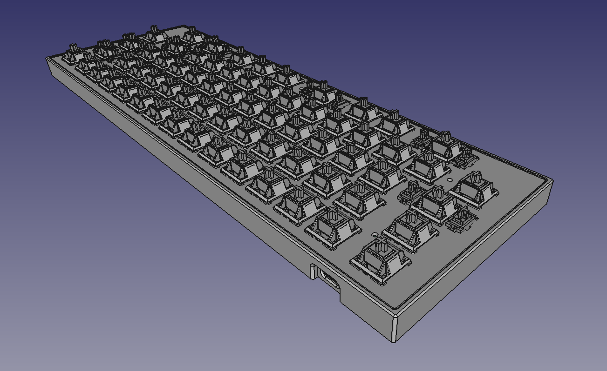
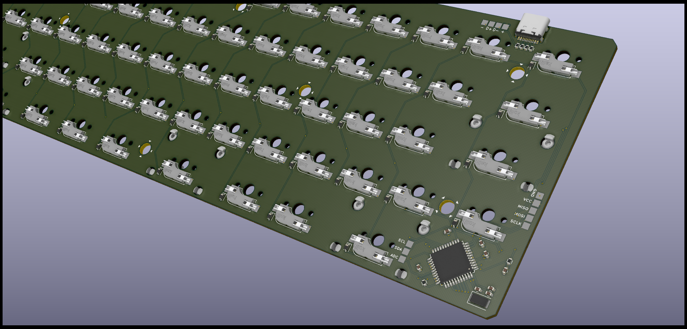

# project-zedekiel
A pain-free 66% keyboard.

## Flashing Guide
You will need linux for this (yes, when the keyboard is flashed, it will work in windows).
If you are using windows, you might want to take a look at [WSL](https://docs.microsoft.com/en-us/windows/wsl/).

- Clone the Zedekiel QMK fork: `git clone git@github.com:KargJonas/qmk_firmware`
- Open the directory: `cd qmk_firmware`
- Compile and flash Zedekiel default layout: `sudo make zedekiel:default:dfu`

If all goes well, your keyboard should now be ready to use.

## Tools used to make this
- KiCad
- LibreOffice
- LibreCad
- FreeCad
- GIMP
- QMK
- [www.keyboard-layout-editor.com](http://www.keyboard-layout-editor.com/)
- [builder.swillkb.com](http://builder.swillkb.com/)
- [qmk.fm/converter](https://qmk.fm/converter/)
- [www.engbedded.com/fusecalc](https://www.engbedded.com/fusecalc/)

## Resources
- [Keyboard PCB Guide](https://github.com/ruiqimao/keyboard-pcb-guide)
- [keebfol.io List of custom MKs](https://keebfol.io/)
- [QMK Getting Started](https://github.com/qmk/qmk_firmware/blob/76189d9a282cc32bf2ff88a84a6374ebb8908433/docs/getting_started_introduction.md)
- [Understanding QMK](https://github.com/qmk/qmk_firmware/blob/76189d9a282cc32bf2ff88a84a6374ebb8908433/docs/understanding_qmk.md)
- [QMK Keyboard Support](https://beta.docs.qmk.fm/configurator/qmk-api/reference_configurator_support)
- [QMK Config Guide](https://beta.docs.qmk.fm/developing-qmk/c-development/hardware_avr)
- [QMK Keycodes](https://github.com/qmk/qmk_firmware/blob/76189d9a282cc32bf2ff88a84a6374ebb8908433/docs/keycodes.md)
- [QMK ISP Flashing Guide](https://beta.docs.qmk.fm/using-qmk/guides/keyboard-building/isp_flashing_guide)
- [DFU Explained](https://electronics.stackexchange.com/questions/299712/how-is-the-atmega32u4-chip-recognized-via-usb)
- (More in `/misc/resources` folder)

## List of small issues and solutions
- KiCad footprint update not reflecting in 3D viewer =>
  - "e" on footprint
  - Edit footprint from Library
  - Edit footprint properties with the symbol in the topbar of the footprint editor
  - Go back to the pcb editor
  - "e" on footprint
  - Update footprint
  - 3D viewer should automatically update the 3D model
- FreeCad CSV import "broken" => export with {TAB} as delimiter.

# More Pictures

