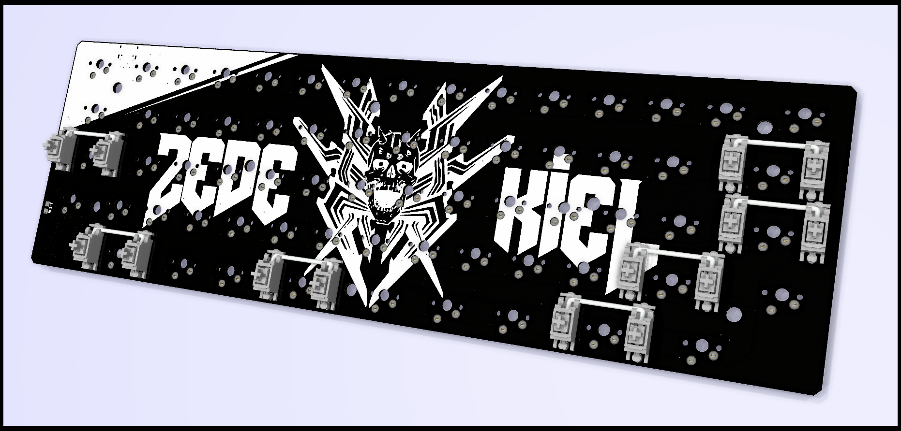
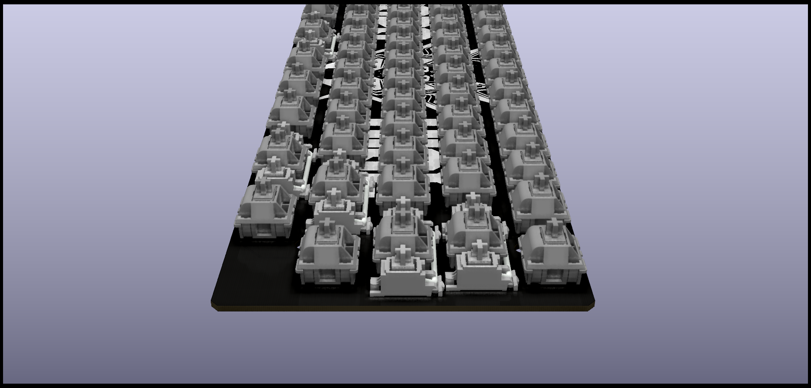
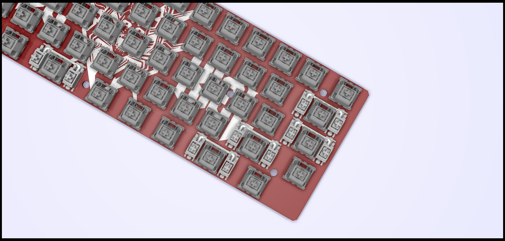
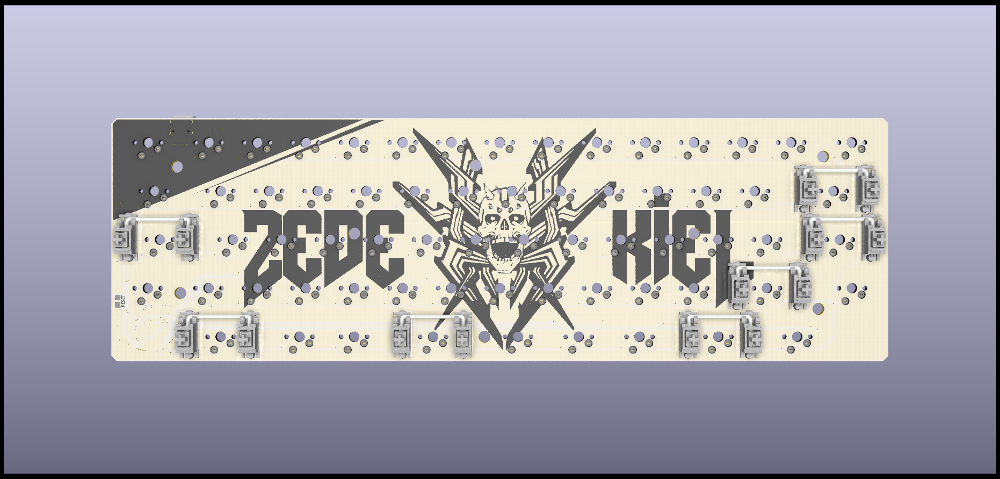
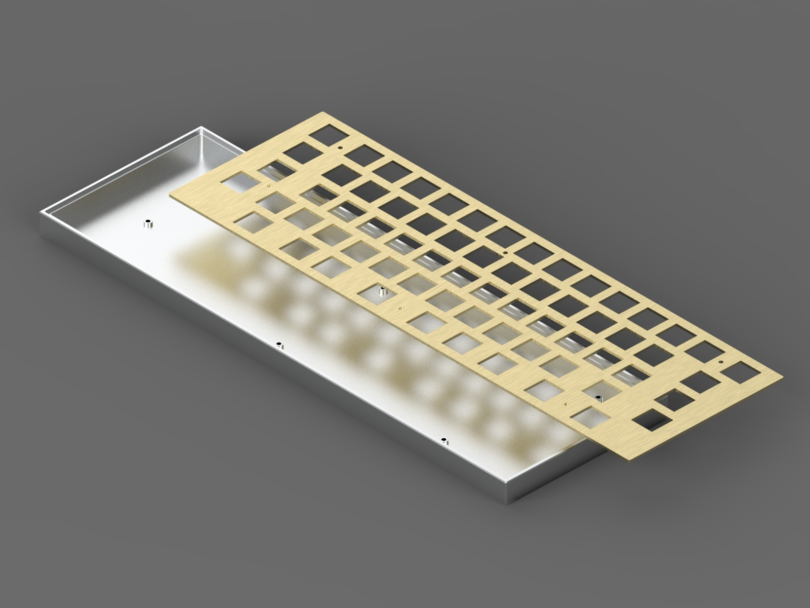

# project-zedekiel
A pain-free 66% keyboard.

## Tools used to make this
- KiCad
- LibreOffice
- LibreCad
- GIMP
- QMK
- http://www.keyboard-layout-editor.com/
- http://builder.swillkb.com/
- https://qmk.fm/converter/
- https://www.engbedded.com/fusecalc/

## Resources
- https://github.com/ruiqimao/keyboard-pcb-guide
- https://keebfol.io/
- [QMK Getting Started](https://github.com/qmk/qmk_firmware/blob/76189d9a282cc32bf2ff88a84a6374ebb8908433/docs/getting_started_introduction.md)
- [Understanding QMK](https://github.com/qmk/qmk_firmware/blob/76189d9a282cc32bf2ff88a84a6374ebb8908433/docs/understanding_qmk.md)
- [QMK Keyboard Support](https://beta.docs.qmk.fm/configurator/qmk-api/reference_configurator_support)
- [QMK Config Guide](https://beta.docs.qmk.fm/developing-qmk/c-development/hardware_avr)
- [QMK Keycodes](https://github.com/qmk/qmk_firmware/blob/76189d9a282cc32bf2ff88a84a6374ebb8908433/docs/keycodes.md)
- [QMK ISP Flashing Guide](https://beta.docs.qmk.fm/using-qmk/guides/keyboard-building/isp_flashing_guide)
- [DFU Explained](https://electronics.stackexchange.com/questions/299712/how-is-the-atmega32u4-chip-recognized-via-usb)
- (More in `/misc/resources` folder)

# More Pictures

